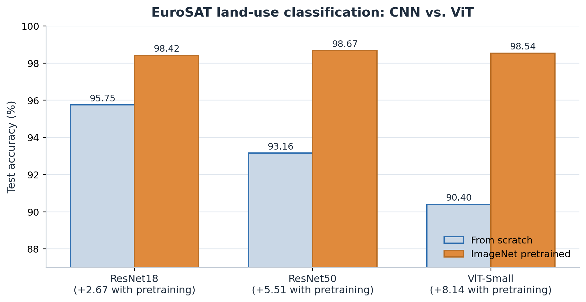

# EuroSAT Land-Use Classification: CNNs vs. Vision Transformers



Satellite land-use classification on the [EuroSAT RGB](https://github.com/phelber/EuroSAT)
dataset (Sentinel-2, 64x64, 10 classes), comparing **ResNet** CNNs and a
**Vision Transformer (ViT-Small)** trained from scratch and from ImageNet
pretrained weights, with attention-map analysis of correct and incorrect
predictions.

The strongest model, an ImageNet-pretrained **ResNet50**, reaches **98.67%**
test accuracy; a much smaller pretrained **ViT-Small** is close behind at
**98.54%**.

## Results

Deterministic 70/15/15 train/validation/test split, 40 epochs, PyTorch.

| Run | Pretrained | Best val. | Test acc. | Macro F1 | Test loss | Train time (s) |
| --- | :---: | ---: | ---: | ---: | ---: | ---: |
| ResNet18 | No | 94.96% | 95.75% | 95.62% | 0.1362 | 34.5 |
| ResNet18 | Yes | 98.12% | 98.42% | 98.36% | 0.0516 | 34.7 |
| ResNet50 | No | 92.07% | 93.16% | 92.91% | 0.2202 | 76.0 |
| **ResNet50** | **Yes** | **98.72%** | **98.67%** | **98.62%** | **0.0458** | 75.3 |
| ViT-Small | No | 89.68% | 90.40% | 90.08% | 0.3038 | 58.2 |
| ViT-Small | Yes | 98.49% | 98.54% | 98.48% | 0.0520 | 57.5 |

### Findings

- **Pretraining dominates.** The accuracy gain from ImageNet weights was
  +2.67 pts (ResNet18), +5.51 pts (ResNet50), and +8.15 pts (ViT-Small); every
  pretrained model landed in a tight 98.4-98.7% band.
- **From scratch, the CNN wins.** Without pretraining the small CNN (ResNet18)
  was the strongest baseline (95.75%) and the transformer was weakest (90.40%),
  consistent with ViTs needing more data or stronger inductive priors.
- **Errors are confident, not ambiguous.** Misclassifications in the ViT
  attention batch were high-confidence and concentrated in overlapping classes
  (`PermanentCrop` -> `HerbaceousVegetation`), rather than low-confidence
  uncertainty.
- `SeaLake` was the easiest class (top per-class F1 in five of six runs);
  `PermanentCrop` was usually the hardest.

## Repository layout

```
eurosat-landuse-classification/
├── figures/results.png              # summary figure (above)
├── train_classifier.py              # training + evaluation for all models
├── visualize_vit_attention.py       # single-image ViT attention maps
├── batch_visualize_vit_attention.py # batch correct/incorrect attention maps
├── outputs/                         # per-run metrics, curves, split manifests
│   ├── resnet18_eurosat_40ep/
│   ├── resnet18_eurosat_40ep_pretrained/
│   ├── resnet50_eurosat_40ep_bs256/
│   ├── resnet50_eurosat_40ep_pretrained_bs256/
│   ├── vit_small_eurosat_40ep/
│   ├── vit_small_eurosat_40ep_pretrained/
│   ├── vit_attention_batch/         # attention maps + summary.csv
│   └── RESULTS_SUMMARY.md
└── report/                          # LaTeX source + final report PDF
```

Model checkpoints (`*.pt`) are excluded; they can be regenerated with the
training script.

## Setup

```bash
python -m venv .venv
./.venv/bin/pip install -r requirements.txt
```

The dataset is expected at `../data/EuroSAT_RGB/EuroSAT_RGB` (adjust in
`train_classifier.py` if needed).

## Train

```bash
./.venv/bin/python train_classifier.py                       # ResNet18, scratch
./.venv/bin/python train_classifier.py --model resnet50
./.venv/bin/python train_classifier.py --model vit_small
./.venv/bin/python train_classifier.py --model resnet50 --pretrained
```

Outputs (metrics, training curves, split manifest) are written under
`outputs/<model>_eurosat_<epochs>ep[_pretrained]`.

## ViT attention maps

```bash
./.venv/bin/python visualize_vit_attention.py
./.venv/bin/python batch_visualize_vit_attention.py --device cuda
```

The batch run produces the correct/incorrect examples in
`outputs/vit_attention_batch/`; several errors are confident confusions into
`HerbaceousVegetation`.

## Report

The full write-up is in [`report/report.pdf`](report/report.pdf) (LaTeX source:
`report/main.tex`).
